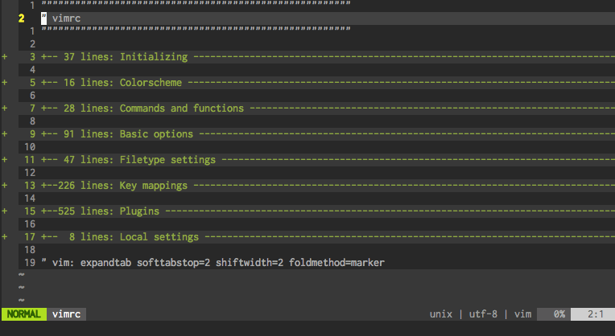

# bufswitcher.vim - Instant buffer switcher

bufswitcher.vim is a Vim plugin to switch buffers instantly using statusline.
This plugin allows you to display buffer names in statusline while you want to.
By displaying buffer list only while switching buffers, you can use this plugin with
any other plugins which customize statusline.  

When many buffers are opened, other great plugins like [unite.vim][unite] or
[ctrlp.vim][ctrlp] are more useful. But when there are a few buffers, bufswitcher
is convenient because it opens no new window and the buffer list in statusline
will close automatically after switching by default.

[unite]: https://github.com/Shougo/unite.vim
[ctrlp]: https://github.com/kien/ctrlp.vim
